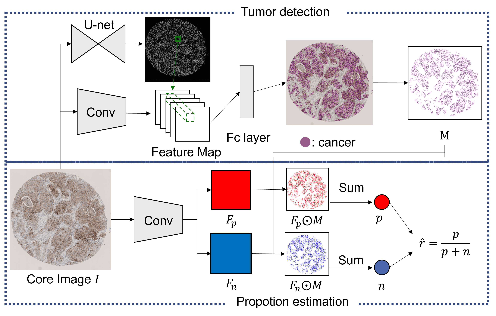

# Automatic positive tumor proportion diagnosis tests

## Prerequisites
- PIL
- pytorch
- opencv
- openslide
- tqdm
- skimage

## Quick start

Running whole script
```
python main.py
```

## Codeについて
|- base_detector : 全ての細胞を検出する  
| 　|- datas : train用のサンプルデータ   
| 　|- model : CNN のmodelのcode  
| 　|- preprocessing  
| 　| 　|- img_slice.py : core画像をpatch画像に切り分けるcode  
|　 | 　|- patch2core.py : 推定結果から細胞の座標を取得するcode  
| 　|- utils : dataloaderのcodeがあるdirectory  
| 　|- basedetector_train.py : 細胞検出の学習code   
| 　L basedetector_pred.py : 学習した重みを使って推定を行うcode  

|- cancer_or_noncancer_detection : 細胞を腫瘍，非腫瘍に分類する  
| 　|- datas : train用のサンプルデータ  
| 　|- model : CNN のmodelのcode      
| 　|- preprocessing  
| 　| 　|- point2patch : core画像の座標からpatch画像の座標に適応させるcode  
| 　|- utils : dataloaderのcodeがあるdirectory  
| 　|- c_or_n_train.py : 腫瘍，非腫瘍分類の学習code  
| 　L c_or_n_pred.py : 学習した重みを使って推定を行うcode  

|- estimation_proportion : 陽性腫瘍比率を推定する  
| 　|- datas : train用のサンプルデータ  
| 　|- model : CNN のmodelのcode + 自作のloss関数   
| 　|- preprocessing  
| 　| 　|- img_resize.py : core画像を入力画像サイズにリサイズするcode  
|　 | 　|- make_mask.py : core画像と腫瘍細胞の座標からマスクを作成するcode  
| 　|- utils : dataloaderのcodeがあるdirectory  
| 　|- proportion_train.py : 陽性腫瘍比率を学習するcode  
| 　L proportion_test.py : 陽性腫瘍比率を出力し評価するcode  

|- sample_ica : 細胞検出をするために色を抜く  
| 　L sample_ica.py : 画像から色を抜くcode  

|- env_file_yml : 用いている環境  

|- param.py : 一括で行うためのパラメータ  

|- main.py : 陽性腫瘍比率の推定を一括で行うcode  
